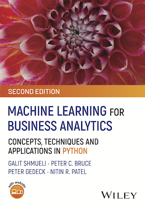

[](https://pypi.org/project/mlba/)
[](https://pypi.org/project/mlba/)


<table>
<tr>
<td></td>
<td>
    <h3>Machine Learning for Business Analytics</h3>
    <p>by Galit Shmueli, Peter C. Bruce, <a href="https://www.amazon.com/Peter-Gedeck/e/B082BJZJKX/">Peter Gedeck</a>, Nitin R. Patel</p>
    <ul>
    <li>Publisher: Wiley; 2nd edition (2025)</li>
    <li>ISBN-13: 978-1-119-54984-0</li>
    </ul>
</td>
</tr>
</table>


## Collection of utility functions for "Machine Learning for Business Analytics" 

For more information about the book and instructor material go to https://www.dataminingbook.com/editions/python-2nd-edition-june-2025.


## Installation
Use `pip` to install the `mlba` package from pypi (https://pypi.org/project/mlba/).
```
pip install mlba
```
Should this not work, for example when you are behind a firewall, download the package from pypi and install from file, e.g.
```
pip install mlba-2.0.tar.gz 
```
